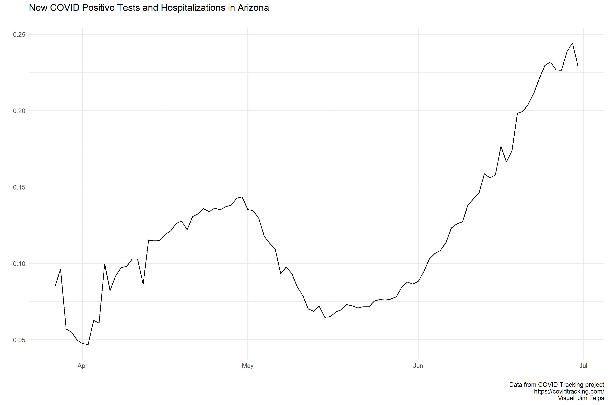
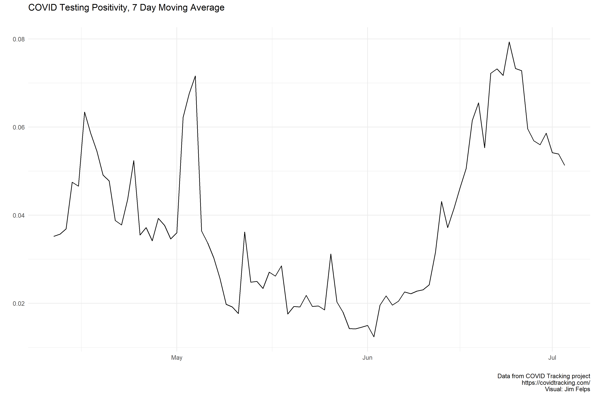
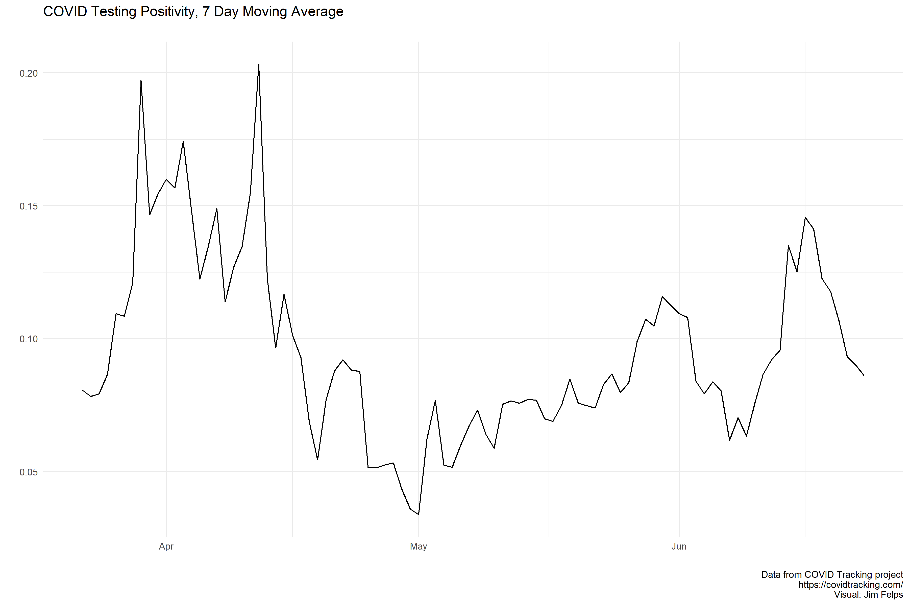
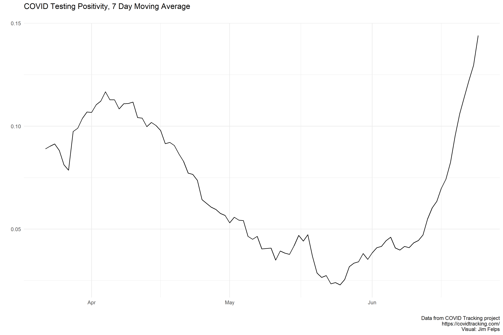
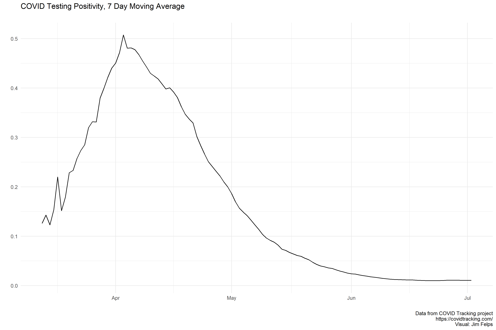

# Missouri

On Mayt 22nd Missouri started reporting antibody testing separately from PCR. The spike you see at the end of May is due to the correction in reported testing on 5/23 (removal of antibody testing from total).

Reporting Notes: https://covidtracking.com/data/state/missouri

# Kansas

# KC Metro County

This data is just positive cases since testing numbers are unavailable from the NYT data. I pulled this data from Kieran Healy's Covdata package, which aggregates mobility data from Apple/Google, European data from the European Centers for Disease Control, State-level data from COVID Tracking Project, State/County data from NYT, and hospitalization data from the US CDC. More info at: https://kjhealy.github.io/covdata/.

# Arizona

Reporting Notes: https://covidtracking.com/data/state/arizona

# Oklahoma

Reporting Notes: https://covidtracking.com/data/state/oklahoma

# Alabama

Reporting Notes: https://covidtracking.com/data/state/alabama

# Florida

The site of all the "sports bubbles". The state started mixing in antibody testing numbers into PCR on 5/15 which could help explain the sharp decline in mid-May.

Reporting Notes: https://covidtracking.com/data/state/florida

# New York

I was just interested to see how this state's curve looked given how bad the epidemic was in NYC.

Reporting Notes: https://covidtracking.com/data/state/new-york

