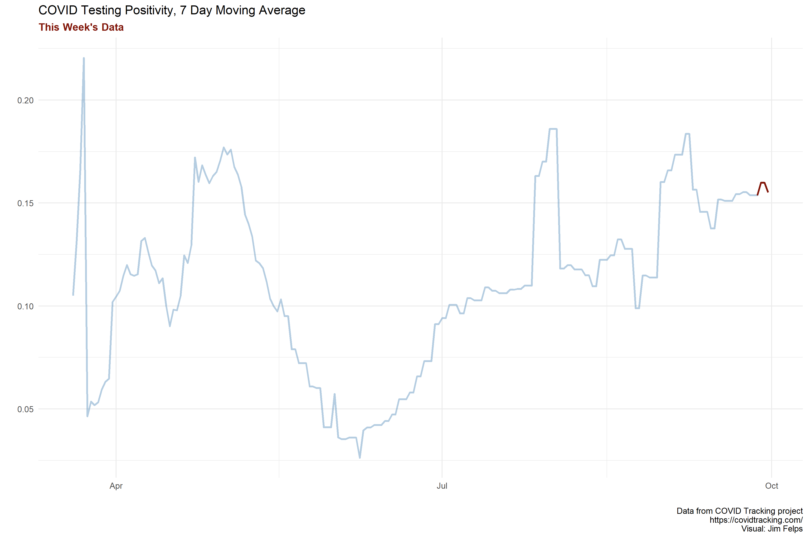
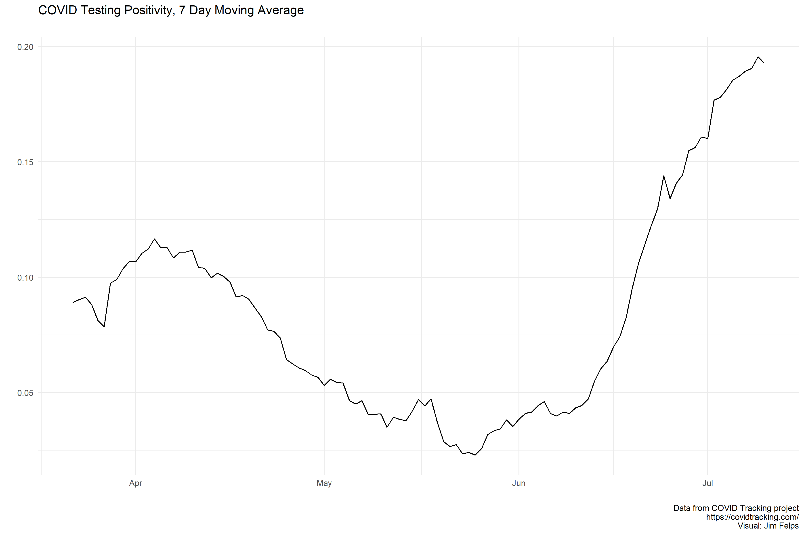
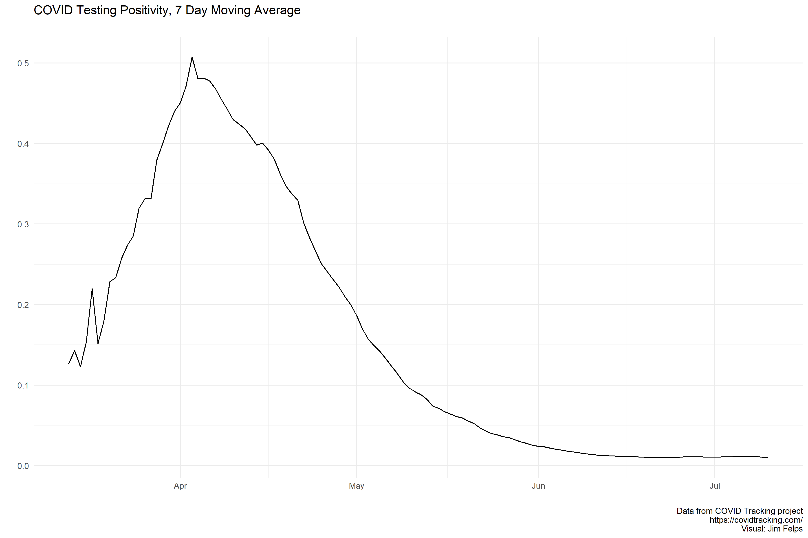

Updated Last: 2020-06-17

# Missouri

On Mayt 22nd Missouri started reporting antibody testing separately from PCR. The spike you see at the end of May is due to the correction in reported testing on 5/23 (removal of antibody testing from total).

Reporting Notes: https://covidtracking.com/data/state/missouri

# Kansas

# KC Metro County

This data is just positive cases since testing numbers are unavailable from the NYT data. I pulled this data from Kieran Healy's Covdata package, which aggregates mobility data from Apple/Google, European data from the European Centers for Disease Control, State-level data from COVID Tracking Project, State/County data from NYT, and hospitalization data from the US CDC. More info at: https://kjhealy.github.io/covdata/.

# All MO Counties

Same as KC Metro data. This is just daily positive tests on a 7 day average. It's a bit confusing but Kansas City and St. Louis Cities have their own health departments, so positive tests in KC are not included in the counties in which the resident lives but in the KC or STL number. To make this even more confusing, there is also a St. Louis county. The red line highlighted below are for **St. Louis county** and **Kansas City**

# Arizona

Reporting Notes: https://covidtracking.com/data/state/arizona

# Oklahoma

Reporting Notes: https://covidtracking.com/data/state/oklahoma

# Alabama

Reporting Notes: https://covidtracking.com/data/state/alabama

# Florida

The site of all the "sports bubbles". The state started mixing in antibody testing numbers into PCR on 5/15 which could help explain the sharp decline in mid-May.

Reporting Notes: https://covidtracking.com/data/state/florida

# New York

I was just interested to see how this state's curve looked given how bad the epidemic was in NYC.

Reporting Notes: https://covidtracking.com/data/state/new-york

