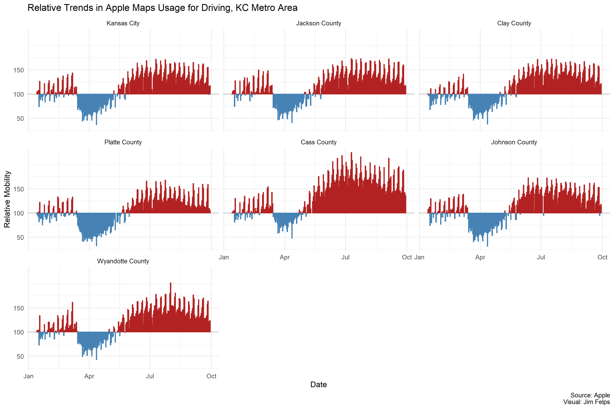
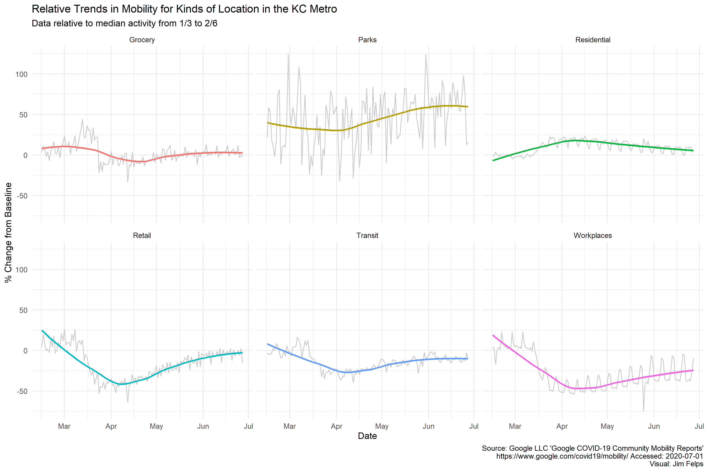
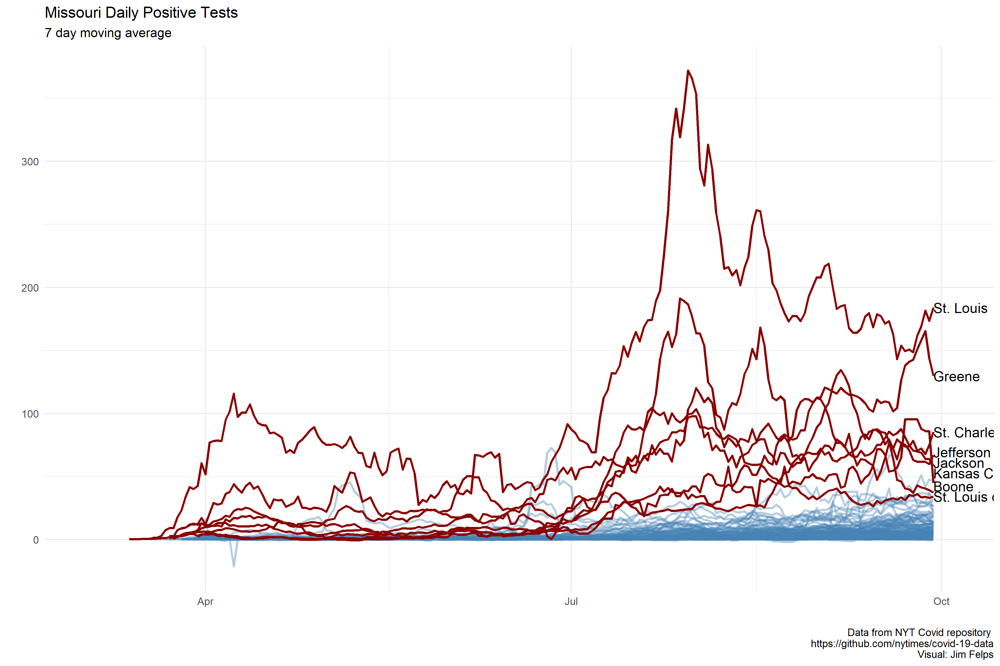
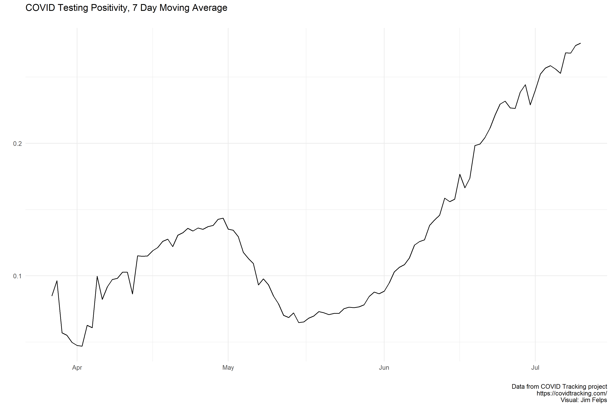
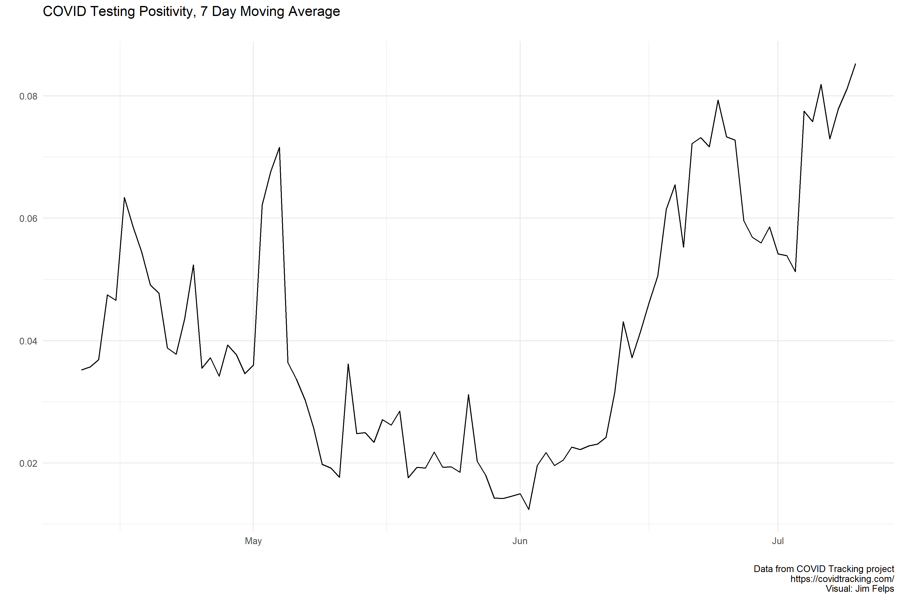
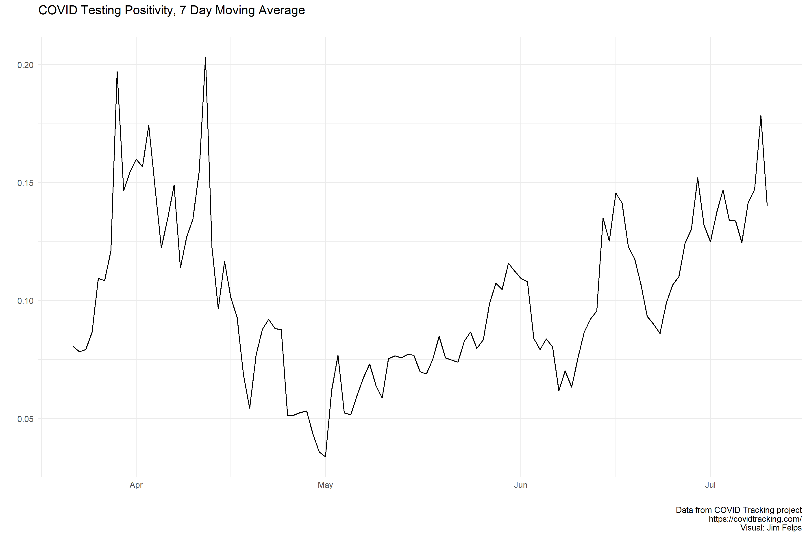

Updated Last: 2020-06-19

# Missouri

On May 22nd Missouri started reporting antibody testing separately from PCR. The spike you see at the end of May is due to the correction in reported testing on 5/23 (removal of antibody testing from total).

[Reporting Notes](https://covidtracking.com/data/state/missouri)

# Kansas

[Reporting Notes](https://covidtracking.com/data/state/kansas)

# KC Metro Mobility

Driving data by metro county (plus KC) indexed to 100 beginning January 13, 2020. This dataset is freely available from Apple as a CSV and requires minimal cleaning to work with (Apple is the best). Data can be downloaded [HERE](https://www.apple.com/covid19/mobility) but you can also access my cleaned data for KC Metro Driving (metro_driving.xlsx) and all forms of transportation for the metro (apple_mobility_metro.xlsx) in the output folder of the repo [HERE](https://github.com/jimfelps/covid-tracking/tree/master/output).

Google mobility data shows traffic across different categories of places. The visual below is the average change for all counties in the KC metro area (Jackson, Clay, Platte, Cass, Johnson (KS), Wyandotte (KS)).

**I'll break this down by county over the weekend.**

# KC Metro County

2020-06-19 update: NYT data is now current. The COVdata package I used to pull NYT data hasn't updated since the 8th, so I am pulling the raw data file directly from the Times repo [HERE](https://github.com/nytimes/covid-19-data). The link includes methodologies used (primarily around excess deaths, which I haven't done for the metro yet) but also an important note about the Kansas City data:

*Four counties (Cass, Clay, Jackson and Platte) overlap the municipality of Kansas City, Mo. The cases and deaths that we show for these four counties are only for the portions exclusive of Kansas City. Cases and deaths for Kansas City are reported as their own line.*

Kansas City Health Department reports all cases/deaths within the KC limits, so all county data does not include KC cases.

This data is just positive cases since testing numbers are unavailable from the NYT data. 

# All MO Counties

2020-06-19 update: NYT data is now current. The COVdata package I used to pull NYT data hasn't updated since the 8th, so I am pulling the raw data file directly from the Times repo [HERE](https://github.com/nytimes/covid-19-data). The link includes methodologies used (primarily around excess deaths, which I haven't done for the metro yet) but also an important note about the Kansas City data:

*Four counties (Cass, Clay, Jackson and Platte) overlap the municipality of Kansas City, Mo. The cases and deaths that we show for these four counties are only for the portions exclusive of Kansas City. Cases and deaths for Kansas City are reported as their own line.*

Kansas City Health Department reports all cases/deaths within the KC limits, so all county data does not include KC cases.

Same as KC Metro data. This is just daily positive tests on a 7 day average. It's a bit confusing but Kansas City and St. Louis Cities have their own health departments, so positive tests in KC are not included in the counties in which the resident lives but in the KC or STL number. To make this even more confusing, there is also a St. Louis county. The red line highlighted below are for **St. Louis county** and **Kansas City**

# Arizona

[Reporting Notes](https://covidtracking.com/data/state/arizona)

# Oklahoma

[Reporting Notes](https://covidtracking.com/data/state/oklahoma)

# Alabama

[Reporting Notes](https://covidtracking.com/data/state/alabama)

# Florida

The site of all the "sports bubbles". The state started mixing in antibody testing numbers into PCR on 5/15 which could help explain the sharp decline in mid-May.

[Reporting Notes](https://covidtracking.com/data/state/florida)

# New York

I was just interested to see how this state's curve looked given how bad the epidemic was in NYC.

[Reporting Notes](https://covidtracking.com/data/state/new-york)

