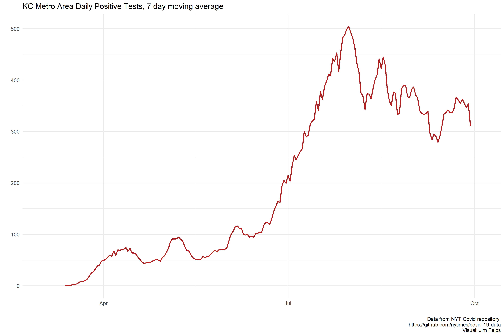
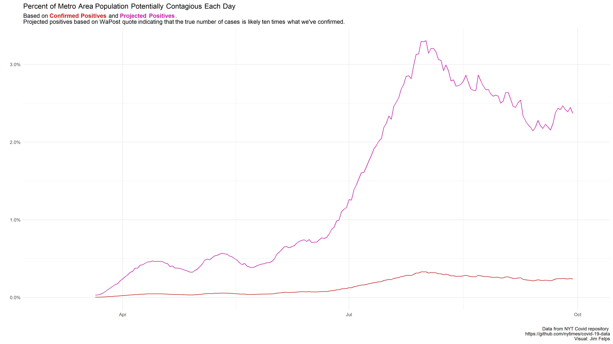
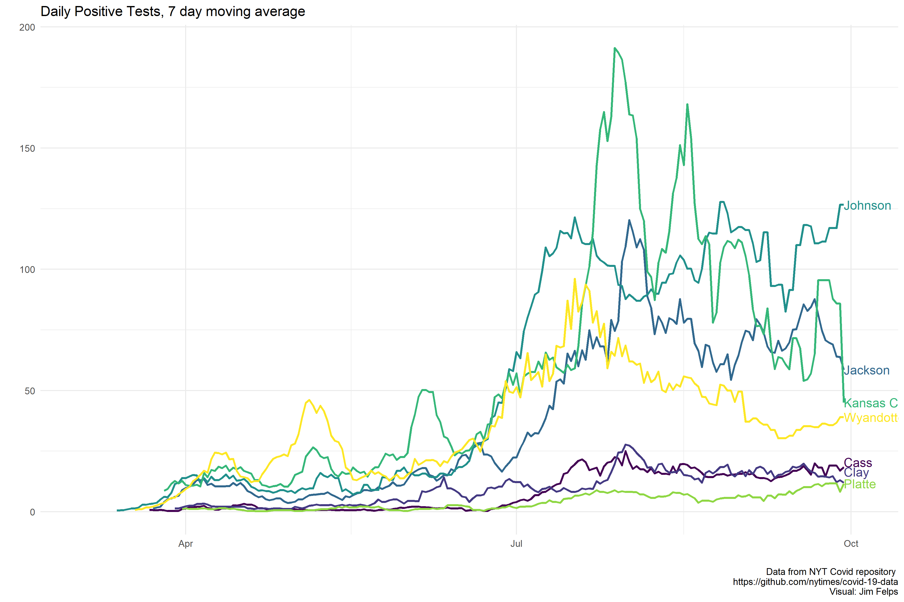
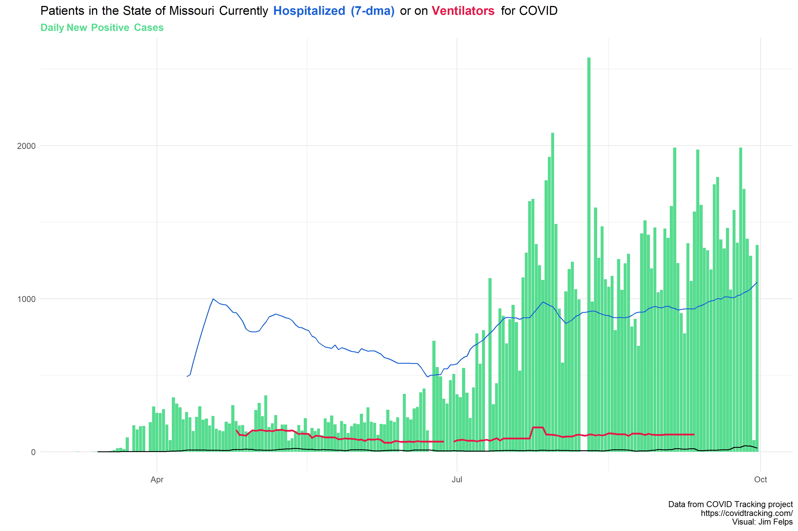

Updated Last: 2020-07-07

# Missouri

On May 22nd Missouri started reporting antibody testing separately from PCR. The spike you see at the end of May is due to the correction in reported testing on 5/23 (removal of antibody testing from total).

[Reporting Notes](https://covidtracking.com/data/state/missouri)

# Kansas

[Reporting Notes](https://covidtracking.com/data/state/kansas)

# Positive Cases, KC Metro

All positive cases in the metro area (Wyandotte, Johnson Co KS, Jackson, Clay, Platte, Cass Co MO). Shown as a 7 day moving average.

# Percent of population that could be infectious

Ballpark figure and projection of the potential number of people in the KC area that are currently infected and potentially spreading the virus. Pink line is the projection based on [THIS ARTICLE](https://www.washingtonpost.com/health/2020/06/25/coronavirus-cases-10-times-larger/) that says the actual number of positive cases is 10x higher than the actual positives. Just a simple look, with a number of assumptions.

# KC Metro Mobility

Driving data by metro county (plus KC) indexed to 100 beginning January 13, 2020. This dataset is freely available from Apple as a CSV and requires minimal cleaning to work with (Apple is the best). Data can be downloaded [HERE](https://www.apple.com/covid19/mobility) but you can also access my cleaned data for KC Metro Driving (metro_driving.xlsx) and all forms of transportation for the metro (apple_mobility_metro.xlsx) in the output folder of the repo [HERE](https://github.com/jimfelps/covid-tracking/tree/master/output).

Google mobility data shows traffic across different categories of places. The visual below is the average change for all counties in the KC metro area (Jackson, Clay, Platte, Cass, Johnson (KS), Wyandotte (KS)).

**I'll break this down by county sometime this week.**

# KC Metro County

2020-07-02 update: After discussing discrepencies between NYT data and official DataKC numbers [(link)](https://www.kcmo.gov/city-hall/departments/health/coronavirus-covid-19/covid-19-totals), it sounds like the case count for KC is too high and the county count is too low. I was told that the state assigns cases to KC, but because of the city's complicated boundaries there are several cases that are removed by the city after verification of recidency. These cases still belong in the metro area, but should be counted in the county numbers. No easy way around this other than pulling data from each county and the city.

2020-06-19 update: NYT data is now current. The COVdata package I used to pull NYT data hasn't updated since the 8th, so I am pulling the raw data file directly from the Times repo [HERE](https://github.com/nytimes/covid-19-data). The link includes methodologies used (primarily around excess deaths, which I haven't done for the metro yet) but also an important note about the Kansas City data:

*Four counties (Cass, Clay, Jackson and Platte) overlap the municipality of Kansas City, Mo. The cases and deaths that we show for these four counties are only for the portions exclusive of Kansas City. Cases and deaths for Kansas City are reported as their own line.*

Kansas City Health Department reports all cases/deaths within the KC limits, so all county data does not include KC cases.

This data is just positive cases since testing numbers are unavailable from the NYT data. 

# All MO Counties

2020-06-22: McDonald County...oh my lord. 196 new cases yesterday. I'll be interested to see if there's any other reason for this. Since testing amounts by county are not available, this could potentially explain the recent rise--this was always a hotspot in Missouri. Possible, I suppose, as it is on the intersection of MO, OK and AR. Freeer flow of traffic as the economy re-opens could also explain. 

2020-06-19 update: NYT data is now current. The COVdata package I used to pull NYT data hasn't updated since the 8th, so I am pulling the raw data file directly from the Times repo [HERE](https://github.com/nytimes/covid-19-data). The link includes methodologies used (primarily around excess deaths, which I haven't done for the metro yet) but also an important note about the Kansas City data:

*Four counties (Cass, Clay, Jackson and Platte) overlap the municipality of Kansas City, Mo. The cases and deaths that we show for these four counties are only for the portions exclusive of Kansas City. Cases and deaths for Kansas City are reported as their own line.*

Kansas City Health Department reports all cases/deaths within the KC limits, so all county data does not include KC cases.

Same as KC Metro data. This is just daily positive tests on a 7 day average. It's a bit confusing but Kansas City and St. Louis Cities have their own health departments, so positive tests in KC are not included in the counties in which the resident lives but in the KC or STL number. To make this even more confusing, there is also a St. Louis county. The red line highlighted below are for **St. Louis county** and **Kansas City**

# Hospitalization/Ventilator Usage - MO

Here's the current count of patients hospitalized or on a ventilator (assume that anyone on a vent is also hospitalized but that doesn't really matter). Daily new cases as bars.

This chart interests me a lot. I wonder what causes the number of hospitalizations/vent usage over time as the number of cases stays equal or rises. I can think of a number of different reasons but am interested if I'm missing anything.

- We've changed the way we treat COVID patients. 
  - Maybe we hospitalized more patients early on as a precaution given how much we didn't know early on.
  - Treatment has improved, possibly
- While the economy has started to open up, those of us more at risk (older, immunocompromised, etc) have stayed home. Cases we see are for less risky segments of the population.
- Early data from the state is wrong or includes observations from an earlier period

I'll be sharing this publically to try to see if anyone else has an opinion.

